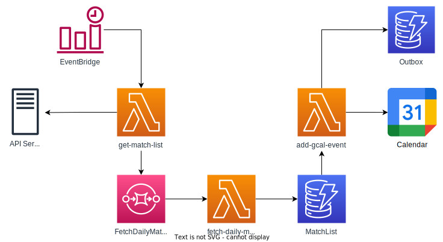

# valorant-match-schedule

You can check worldwide VALORANT matches schedule in Google Calendar.

## Public URL

- TBA

## Architecture overview


1. Lambda function: `get-match-list` is periodically invoked from EventBridge
2. `get-match-list` fetches data from API service and put into DynamoDB table: `MatchList`
3. `MatchList` table streams captures item-level data modification to Lambda function: `add-gcal-event`
4. `add-gcal-event` creates/modifies Google Calendar events. `Outbox` table manages their state and information.

## Prerequisites

If you want to do it yourself, you should be ready with:
- account keys for Google Cloud IAM ( `google_key.json` ): see [here](https://cloud.google.com/iam/docs/creating-managing-service-account-keys)

    ```bash
    git clone https://github.com/miztch/valorant-match-schedule
    cp google_key.json valorant-match-schedule/add-gcal-event/function/google_key.json
    ```
- calendars and their ids for each regions: see [here](https://docs.simplecalendar.io/find-google-calendar-id/)
  - 5 calendars are needed. (for `EMEA`, `NA`, `BR/LATAM`, `APAC`, `EAST_ASIA`)

## Provisioning

You can use [AWS SAM](https://docs.aws.amazon.com/serverless-application-model/latest/developerguide/serverless-sam-cli-install.html) to provision this function.

- first, you have to deploy `add-gcal-event`
  ```bash
  cd valorant-match-schedule/add-gcal-event/
  sam build
  sam deploy --guided
  ```

- then, you can deploy `get-match-list`
  ```bash
  cd ../get-match-list/
  sam build
  sam deploy --guided
  ```